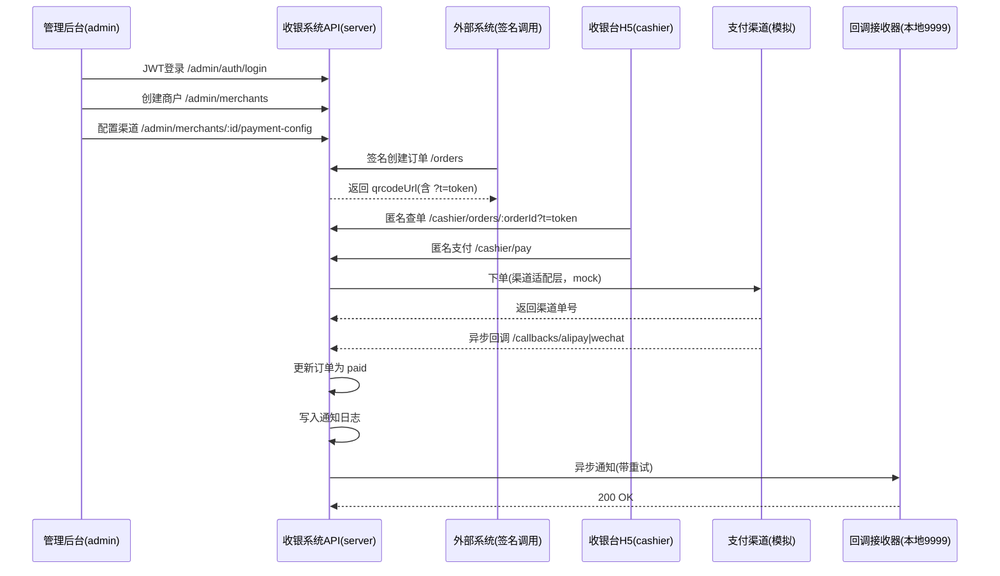

# 统一收银系统：本地联调全流程（含模拟商户）

本文档给出一条**最短可跑通闭环**：从管理后台创建商户 → 外部签名创建订单 → 收银台支付 → 渠道回调 → 异步通知。

已在本仓库中通过脚本 `scripts/mock-merchant-flow.mjs` 跑通。

## 0. 前置条件

- MongoDB 与 Redis 已启动（默认端口即可）
- Node.js 20+ 可用

如果你使用 Homebrew 安装的是 `node@20`，需要先确保 PATH 生效：

```bash
export PATH="/opt/homebrew/opt/node@20/bin:$PATH"
```

## 1. 安装依赖

推荐使用 `pnpm`（本地已验证）：

```bash
corepack enable
corepack prepare pnpm@9.15.4 --activate

pnpm -C server install --force
pnpm -C admin install --force
pnpm -C cashier install --force
```

## 2. 启动三个项目

在仓库根目录执行：

```bash
mkdir -p logs

nohup pnpm -C server run start:dev > logs/server.log 2>&1 & echo $! > logs/server.pid
nohup pnpm -C admin run dev > logs/admin.log 2>&1 & echo $! > logs/admin.pid
nohup pnpm -C cashier run dev > logs/cashier.log 2>&1 & echo $! > logs/cashier.pid
```

默认访问地址：

- 后端：`http://localhost:3000`
- 管理后台：`http://localhost:5173`
- 收银台：`http://localhost:8080`

## 3. 一键模拟商户跑完整流程

直接执行：

```bash
node scripts/mock-merchant-flow.mjs
```

脚本会自动完成：

1. 启动本地回调接收器（`http://127.0.0.1:9999/payment-callback`）
2. 管理端登录（JWT）
3. 创建模拟商户（返回 `appKey / appSecret`）
4. 配置微信/支付宝渠道（使用 mock 配置）
5. 使用签名机制创建订单（外部 API）
6. 调用收银台 API 发起支付
7. 模拟渠道回调并等待订单变为 `paid`
8. 等待异步通知发送到本地回调接收器

脚本最后会输出一份完整 `summary`，包含商户、订单、支付、回调信息。

## 3.1 外部系统 Demo（更接近真实对接）

如果你希望有一个“外部系统”以服务方式真实对接（并接收异步通知），可以直接启动：

```bash
node scripts/external-system-demo.mjs
```

然后在浏览器打开：

- `http://127.0.0.1:9999`

页面会提供按钮与流程：

1. Bootstrap Merchant（通过 admin API 创建商户并配置 mock 渠道）
2. Create Signed Order（以签名方式调用 `/api/v1/orders`）
3. Full Pay（调用收银台 API + 模拟渠道回调 + 等待 paid）

页面会同时展示：

- 商户的 `appKey / appSecret`
- 订单列表（可直接打开收银台 H5）
- 外部系统收到的异步通知（server -> notifyUrl）

可选环境变量：

- `BASE_URL`：后端地址（默认 `http://localhost:3000`）
- `CASHIER_BASE_URL`：收银台地址（默认 `http://localhost:8080`）
- `EXTERNAL_DEMO_PORT`：外部系统端口（默认 `9999`）
- `ADMIN_USERNAME / ADMIN_PASSWORD`：管理后台账号密码

## 3.2 外部业务系统项目（可启动服务 + 页面跳转 + SDK 接入）

上面的 3.1 更像“联调用脚本服务”。如果你要的是一个更像真实业务方的项目，请使用：

- `external-demo/`（外部业务系统 demo 项目）
- 后端 SDK：`external-demo/sdk/cashier-sdk.mjs`
- 服务入口：`external-demo/server.mjs`

启动方式（在仓库根目录）：

```bash
npm run dev:external-biz
```

然后打开：

- `http://127.0.0.1:7001`

建议按页面按钮走完整链路：

1. Bootstrap Merchant（外部系统调用 SDK 创建商户、配置支付渠道、配置外部系统信息）
2. 在外部系统页面点击“支付”，跳转到收银台：
   - `http://localhost:8080/external?merchantId=...&externalOrderId=...`
3. 收银台请求收银系统 Server：
   - 收银系统根据 `externalOrderId` 调用外部系统 Server 拉取订单快照
   - 校验签名后创建 Payment，并返回收银台二维码数据
4. 支付完成后：
   - 第三方渠道回调 -> 收银系统更新支付状态
   - 收银系统通过 Webhook 回调外部系统
   - 收银台页面可“返回业务系统”查看结果页

可选环境变量：

- `EXTERNAL_BIZ_PORT`：外部业务系统端口（默认 `7001`）
- `CASHIER_SERVER_BASE_URL`：收银系统 Server 地址（默认 `http://localhost:3000`）
- `CASHIER_CLIENT_BASE_URL`：收银台地址（默认 `http://localhost:8080`）
- `ADMIN_USERNAME / ADMIN_PASSWORD`：管理后台账号密码

## 4. 流程图（端到端）



## 5. 手动验证入口

- 管理后台登录页：`http://localhost:5173/login`
  - 默认账号：`admin / admin123`
- 收银台示例：
  - 脚本输出的 `order.qrcodeUrl`
  - 形如：`http://localhost:8080/pay/{orderId}?t={token}`

## 6. 停止服务

```bash
kill $(cat logs/server.pid) $(cat logs/admin.pid) $(cat logs/cashier.pid)
```
