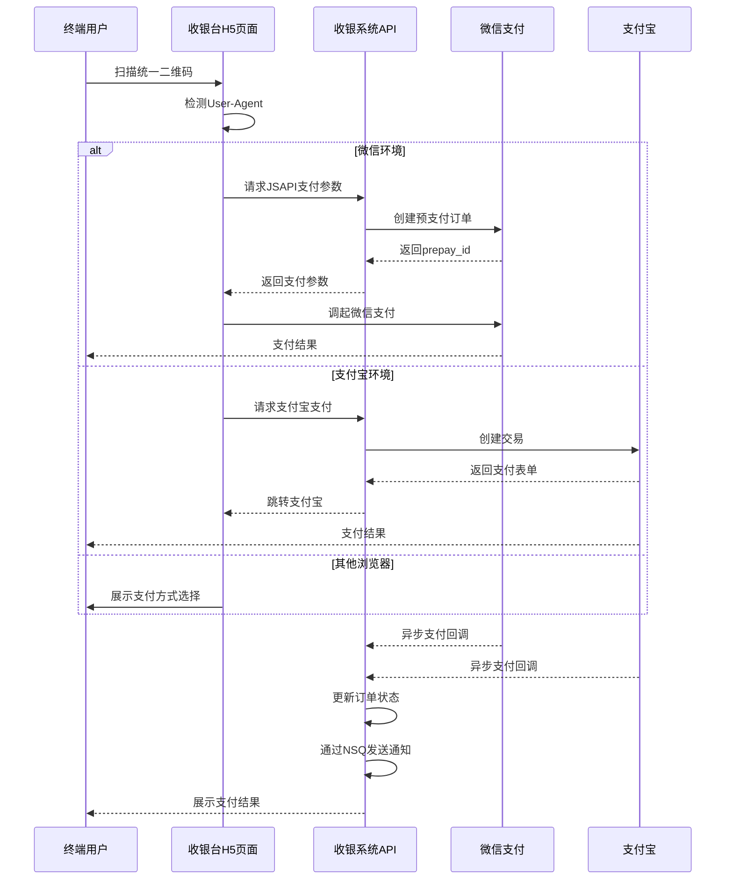
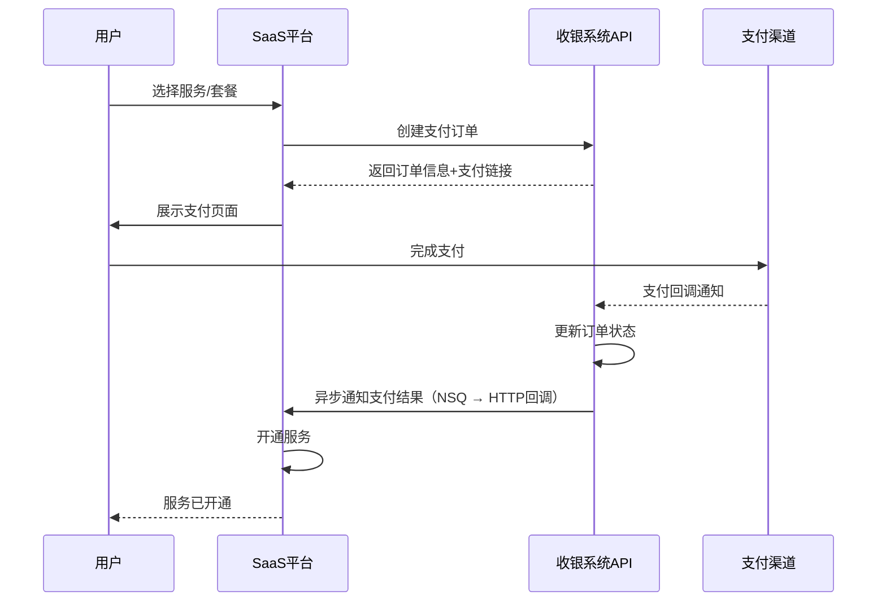
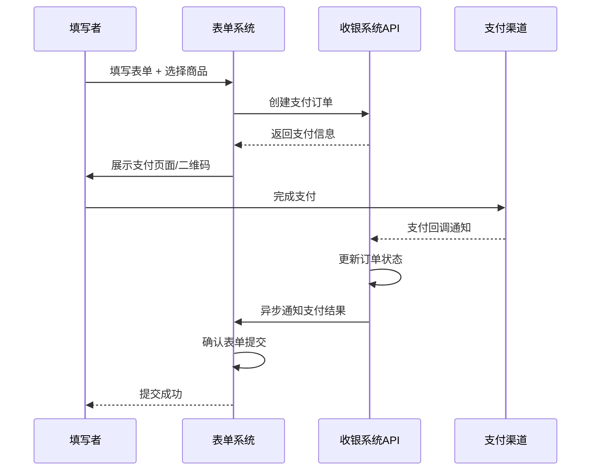
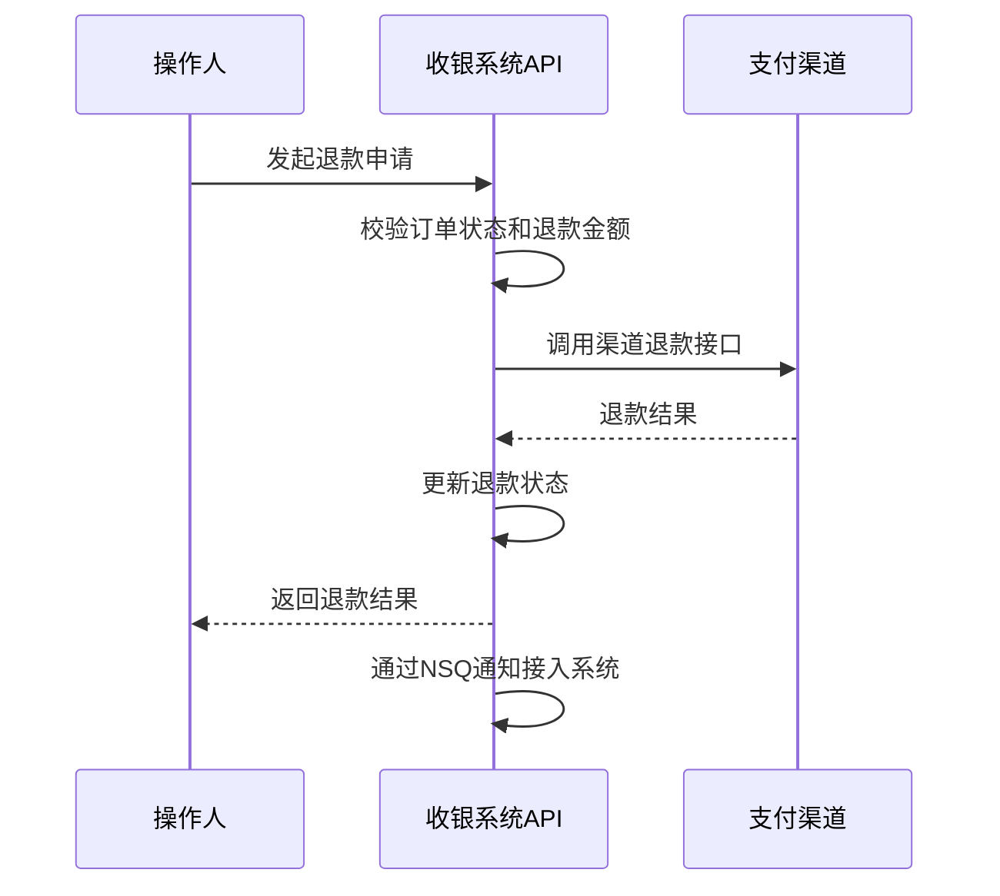
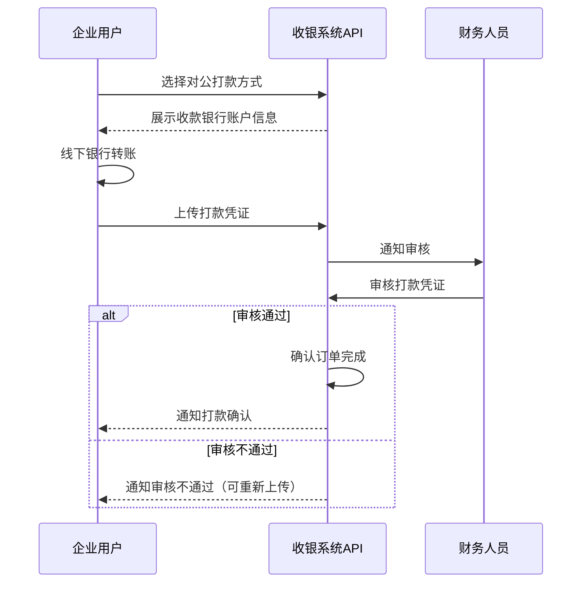
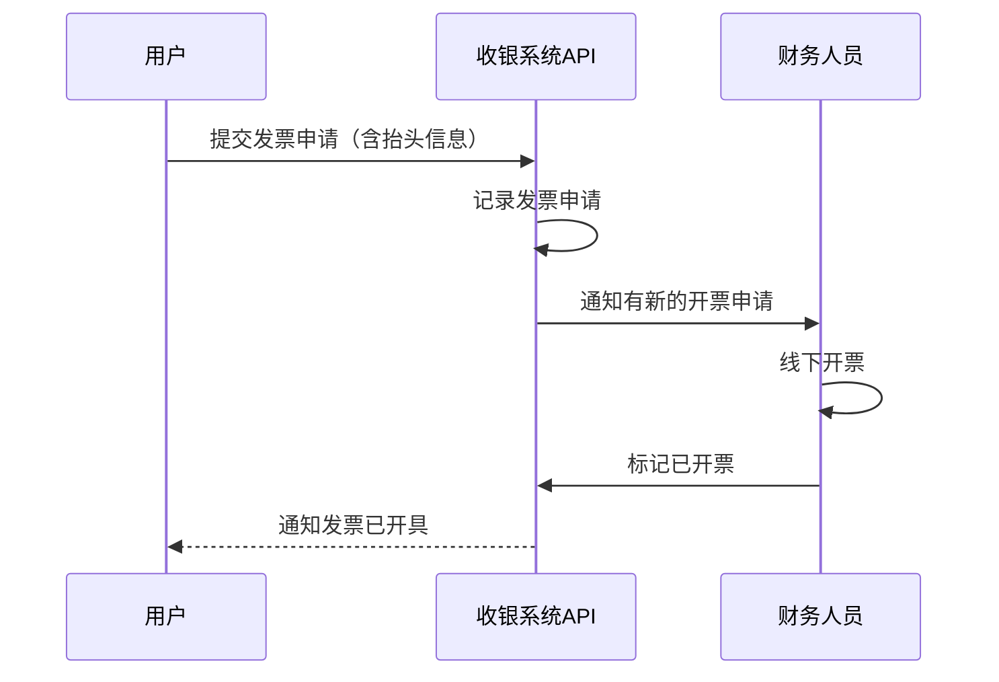

# 统一收银系统 — 需求文档

## 1. 文档信息

| 项目     | 内容                 |
| -------- | -------------------- |
| 文档名称 | 统一收银系统需求文档 |
| 版本     | v1.0                 |
| 创建日期 | 2026-01-27           |
| 文档状态 | 草稿                 |

---

## 2. 项目概述

### 2.1 项目背景

当前各业务系统（SaaS 平台、表单系统等）各自对接支付渠道，存在以下痛点：

- 各系统重复开发支付模块，维护成本高
- 支付证书、密钥分散管理，安全风险大
- 支付数据分散，无法统一对账和分析
- 新系统接入支付能力需要重复投入开发资源

**项目目标**：构建一套独立的、功能闭包的统一收银系统，将多个平台的支付能力统一收归管理，实现一次对接、多端复用。

### 2.2 项目范围

**本期（一期）范围**：

- 国内微信/支付宝聚合支付
- 统一扫码支付二维码
- SaaS 收款场景
- 表单收款场景
- 订单管理与支付记录查询（payset）
- 支付证书密钥管理
- JSON 格式日志输出（对接阿里云日志系统）

**远期规划**：

- 国际支付系统接入（Stripe、PayPal 等，满足国外用户支付需求）
- 对外提供 SDK（TypeScript 版和 Go 语言版）
- 对公打款完整流程
- 电子发票自动化
- 退款管理

### 2.3 术语定义

| 术语          | 说明                                                                            |
| ------------- | ------------------------------------------------------------------------------- |
| 统一收银系统  | 本项目，为多个业务系统提供统一支付能力的中台系统                                |
| 聚合支付      | 将微信支付、支付宝等多种支付渠道聚合为统一接口                                  |
| 支付渠道      | 具体的支付服务提供方，如微信支付、支付宝                                        |
| 商户          | 接入本系统的业务系统，每个商户拥有独立的支付配置                                |
| 支付证书/密钥 | 与支付渠道通信所需的身份凭证和加密密钥                                          |
| payset        | 支付记录集，返回格式包含 total（总数）、fieldset（字段定义）、dataset（数据集） |
| NSQ           | 轻量级分布式消息队列，用于异步消息处理                                          |
| 对公打款      | 企业对公银行转账付款流程                                                        |
| 统一扫码      | 生成一个二维码，自动识别微信/支付宝扫码环境并调用对应支付                       |

---

## 3. 应用场景

### 3.1 SaaS 收款场景

面向 SaaS 平台的内部收款需求：

- **购买服务**：用户购买 SaaS 平台的核心服务（按月/按年订阅）
- **购买增值功能**：用户购买短信包、邮件包、高级功能解锁等增值服务

**典型用户旅程**：

1. 用户在 SaaS 平台选择要购买的服务/套餐
2. SaaS 平台调用收银系统创建支付订单
3. 收银系统生成支付二维码或调起支付页面
4. 用户完成支付
5. 收银系统异步通知 SaaS 平台支付结果
6. SaaS 平台开通对应服务

### 3.2 用户表单收款场景

面向通过表单进行商品/服务售卖的场景：

- **购买门票**：活动主办方通过表单收取门票费用
- **购买课程**：教育机构通过表单收取课程费用
- **购买商品**：商家通过表单收取商品费用

**典型用户旅程**：

1. 表单发布者配置商品信息（名称、价格、库存、规格等）
2. 填写者访问表单，填写信息并选择商品
3. 提交表单时调用收银系统创建支付订单
4. 用户通过扫码或在线支付完成付款
5. 收银系统通知表单系统支付成功
6. 表单提交完成

### 3.3 对公打款场景

面向 B2B 企业间的对公付款需求：

- 企业用户选择对公打款方式
- 系统展示收款银行账户信息
- 企业完成线下银行转账
- 上传打款凭证
- 财务人员人工审核确认到账
- 系统确认订单完成

---

## 4. 功能需求

### 4.1 支付渠道管理

#### 4.1.1 微信支付接入

- 支持 Native 支付（PC 端扫码）
- 支持 JSAPI 支付（微信公众号/小程序内）
- 支持 H5 支付（手机浏览器）

#### 4.1.2 支付宝接入

- 支持电脑网站支付
- 支持手机网站支付
- 支持当面付（扫码支付）

#### 4.1.3 统一扫码支付

- 生成统一的支付二维码，一码同时支持微信和支付宝
- 扫码后自动识别支付环境（通过 User-Agent 检测）
- 微信扫码自动调起微信支付，支付宝扫码自动调起支付宝支付
- 其他浏览器环境提供支付方式选择

#### 4.1.4 支付证书密钥管理

- 为每个接入系统（商户）维护独立的支付渠道配置
- 支付证书、密钥加密存储
- 支持证书更新和轮换

#### 4.1.5 国际支付渠道预留

- 系统架构预留国际支付渠道接入能力
- 本期仅做接口抽象，不实现具体渠道（Stripe、PayPal 等后续接入）

### 4.2 订单管理

- **创建订单**：接入系统调用接口创建支付订单
- **查询订单**：支持按订单号、商户订单号、时间范围等条件查询
- **关闭订单**：支持主动关闭未支付订单
- **订单状态流转**：待支付 → 支付中 → 已支付 → 已退款/已关闭
- **订单超时**：未支付订单超时自动关闭（默认 30 分钟）
- **幂等性**：同一业务订单不可重复创建和支付

### 4.3 支付记录（payset）

- 支付记录查询接口，参考表单数据返回接口设计
- 返回格式包含三部分：
  - **total**：符合条件的记录总数
  - **fieldset**：字段定义列表（字段名、显示名、类型）
  - **dataset**：数据记录列表
- 支持分页、筛选、排序查询
- 支持数据导出

### 4.4 退款管理

- 支持全额退款和部分退款
- 退款状态跟踪（待退款 → 退款中 → 已退款/退款失败）
- 退款原因记录
- 退款到原支付渠道

### 4.5 对公打款

- 打款申请：生成收款银行账户信息
- 银行账户信息管理
- 打款凭证上传（图片）
- 人工审核确认流程
- 审核通过后确认订单完成

### 4.6 发票管理

- **发票抬头收集**：支持个人和企业发票抬头
  - 企业：公司名称、税号、注册地址、注册电话、开户行、银行账号
  - 个人：姓名
- **第一期**：人工开票流程
  - 用户提交发票申请
  - 财务人员线下开票
  - 标记已开票状态
- **后续迭代**：接入电子发票平台，实现自动开票

### 4.7 商户/接入系统管理

- 接入系统（商户）注册与信息管理
- 每个商户独立的 AppKey / AppSecret 生成
- 支付渠道配置（微信商户号、支付宝应用 ID 等）
- 商户状态管理（启用/停用）
- 回调地址配置
- IP 白名单配置

### 4.8 SDK 提供

为方便外部系统接入，提供两种语言的 SDK：

**TypeScript SDK**（NPM 包）：

- 创建订单
- 查询订单
- 关闭订单
- 查询支付记录（payset）
- 发起退款
- 查询退款

**Go SDK**（Go Module）：

- 功能与 TypeScript SDK 一致
- 提供完整的类型定义

**SDK 认证方式**：AppKey + AppSecret 签名机制

### 4.9 日志与监控

- 所有日志输出为 JSON 格式文件
- 日志字段包含：时间戳、日志级别、模块名、链路追踪 ID、商户 ID、订单号、操作类型、消息内容
- 方便对接阿里云日志服务（SLS）
- 关键业务操作审计日志（支付、退款、配置变更等）

---

## 5. 非功能需求

### 5.1 安全性

- 所有通信使用 HTTPS（TLS 1.2+）
- 支付证书密钥加密存储（AES-256）
- API 接口签名验证（HMAC-SHA256）
- 防重放攻击（timestamp + nonce 校验）
- 敏感信息脱敏展示（银行卡号、身份证号等）
- IP 白名单访问控制

### 5.2 可靠性

- 支付回调通知重试机制（指数退避策略）
- 消息队列（NSQ）保障异步任务可靠投递
- 关键操作幂等性保障
- 数据库事务一致性

### 5.3 性能

- 支付接口响应时间 < 500ms（不含第三方支付渠道耗时）
- 查询接口响应时间 < 200ms
- 支持并发支付请求 >= 100 TPS

### 5.4 可扩展性

- 支付渠道可插拔设计，新增渠道无需修改现有代码
- 新接入系统通过配置即可完成接入
- 国际支付渠道可平滑接入

### 5.5 可用性

- 系统可用性目标 >= 99.9%
- 核心链路降级方案（如 Redis 不可用时降级到数据库直查）
- 健康检查与自动恢复机制

---

## 6. 用户角色

| 角色           | 职责                                                       |
| -------------- | ---------------------------------------------------------- |
| 系统管理员     | 管理支付渠道配置、管理接入系统（商户）、查看全局数据和监控 |
| 接入系统管理员 | 管理本系统的支付配置、查看本系统交易数据、管理回调地址等   |
| 终端用户       | 扫码支付、查看支付结果                                     |
| 财务人员       | 对账、退款审批、发票管理、对公打款审核                     |

---

## 7. 业务流程图

### 7.1 统一扫码支付流程

### 7.2 SaaS 购买流程

### 7.3 表单收款流程

### 7.4 退款流程

### 7.5 对公打款流程

### 7.6 发票申请流程

---

## 8. 验收标准

### 8.1 功能验收

| 编号 | 验收项       | 验收标准                                                        |
| ---- | ------------ | --------------------------------------------------------------- |
| F-01 | 统一扫码支付 | 微信/支付宝扫同一二维码，均能正确调起对应支付                   |
| F-02 | 微信支付     | 支持 Native、JSAPI、H5 三种支付方式，支付成功后订单状态正确更新 |
| F-03 | 支付宝支付   | 支持电脑网站、手机网站、当面付，支付成功后订单状态正确更新      |
| F-04 | 订单管理     | 订单创建、查询、关闭功能正常，超时自动关闭                      |
| F-05 | 支付记录查询 | payset 接口返回正确的 total、fieldset、dataset 格式             |
| F-06 | 退款         | 全额/部分退款正常，状态跟踪正确                                 |
| F-07 | 商户管理     | 商户注册、配置、密钥管理功能正常                                |
| F-08 | 对公打款     | 打款流程完整，凭证上传和审核正常                                |
| F-09 | 发票管理     | 发票抬头收集和人工开票流程正常                                  |
| F-10 | 异步通知     | 支付结果能正确通知到接入系统，失败自动重试                      |
| F-11 | 日志输出     | 日志为 JSON 格式，包含完整业务字段                              |

### 8.2 非功能验收

| 编号  | 验收项   | 验收标准                           |
| ----- | -------- | ---------------------------------- |
| NF-01 | 接口性能 | 支付接口 < 500ms，查询接口 < 200ms |
| NF-02 | 安全性   | 通过 API 签名验证、防重放攻击测试  |
| NF-03 | 幂等性   | 重复请求不会产生重复订单或重复支付 |
| NF-04 | 数据安全 | 支付密钥加密存储，敏感信息脱敏展示 |

---

## 9. 里程碑建议

### 第一期：核心支付能力

- 微信/支付宝聚合支付
- 统一扫码支付二维码
- 订单管理（创建、查询、关闭、超时）
- 支付记录查询（payset）
- 商户/接入系统管理
- 支付证书密钥管理
- JSON 日志输出
- 管理后台基础功能
- Taro 收银台页面

### 第二期：完善能力

- 对外 SDK 发布（TypeScript + Go）
- 退款管理
- 发票管理（人工开票）
- 对公打款完整流程
- 数据导出功能

### 第三期：扩展能力

- 国际支付渠道接入（Stripe、PayPal）
- 电子发票自动化
- 高级数据分析与报表
- 订阅制/按量计费支持

---

## 10. 风险与依赖

| 风险/依赖             | 说明                           | 应对措施                         |
| --------------------- | ------------------------------ | -------------------------------- |
| 微信/支付宝商户号申请 | 需要企业资质，审批有周期       | 提前申请，开发阶段使用沙箱环境   |
| 支付资质合规          | 需符合相关法规要求             | 咨询法务，确保合规               |
| 第三方支付接口变更    | 微信/支付宝 API 可能升级或调整 | 渠道适配层隔离，变更仅影响适配器 |
| 数据安全要求          | 支付数据安全要求高             | 加密存储、安全审计、定期安全评估 |
| 阿里云日志服务依赖    | 日志系统依赖阿里云 SLS         | 日志本地文件兜底，SLS 对接可延后 |

---

## 附录

### 参考资料

- 金数据（<https://jinshuju.net/）——> 表单收款模式参考
- 微信支付开发文档
- 支付宝开放平台文档
