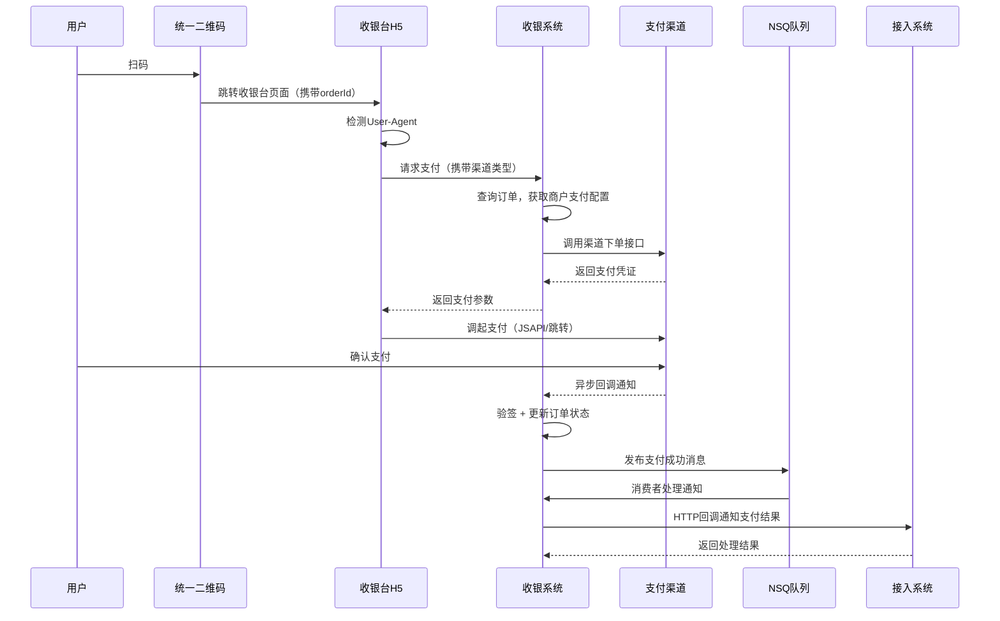

# 统一收银系统 — 技术设计文档

## 1. 文档信息

| 项目     | 内容                     |
| -------- | ------------------------ |
| 文档名称 | 统一收银系统技术设计文档 |
| 版本     | v1.0                     |
| 创建日期 | 2026-01-27               |
| 文档状态 | 草稿                     |

---

## 2. 系统概述

### 2.1 系统定位

统一收银系统是一套独立的、功能闭包的支付中台，为多个业务系统（SaaS 平台、表单系统等）提供统一的支付能力。系统通过 API 和 SDK 对外提供服务，支持微信/支付宝聚合支付，未来可扩展国际支付渠道。

### 2.2 技术选型

| 层次     | 技术                           | 说明                                      |
| -------- | ------------------------------ | ----------------------------------------- |
| 后端框架 | TypeScript + NestJS            | 模块化架构，依赖注入，TypeScript 类型安全 |
| 数据库   | MongoDB                        | 文档模型适配灵活的支付记录结构，支持事务  |
| 缓存     | Redis                          | 分布式锁、幂等控制、限流、会话管理        |
| 消息队列 | NSQ                            | 轻量级、高吞吐，支持异步通知和重试队列    |
| 前端框架 | TypeScript + Vue3              | 管理后台 SPA                              |
| 跨端框架 | Taro                           | 微信小程序 + H5 收银台页面                |
| SDK      | TypeScript (npm) + Go (module) | 供接入系统调用                            |

### 2.3 选型说明

- **MongoDB**：支付记录的 fieldset/dataset 灵活结构天然适配文档模型；MongoDB 4.0+ 支持多文档事务，满足支付场景数据一致性要求。所有支付关键操作必须使用事务。
- **NSQ**：轻量级、无单点故障（nsqlookupd 服务发现）、高吞吐，适合支付回调通知的异步投递和重试场景。
- **Redis**：支付幂等性控制（分布式锁）、订单超时管理、API 限流、支付状态缓存。
- **Taro**：一套代码支持微信小程序和 H5，适合收银台多端需求。

---

## 3. 系统架构

### 3.1 整体架构

```
┌─────────────────────────────────────────────────────────┐
│                       接入层                              │
│  ┌──────────┐  ┌──────────┐  ┌──────────┐  ┌──────────┐ │
│  │ Vue3     │  │ Taro     │  │ TS SDK   │  │ Go SDK   │ │
│  │ 管理后台  │  │ 收银台   │  │ (npm)    │  │ (module) │ │
│  └────┬─────┘  └────┬─────┘  └────┬─────┘  └────┬─────┘ │
└───────┼──────────────┼─────────────┼─────────────┼───────┘
        │              │             │             │
        ▼              ▼             ▼             ▼
┌─────────────────────────────────────────────────────────┐
│                    API Gateway                           │
│          统一入口 · 鉴权 · 限流 · 路由                    │
└───────────────────────┬─────────────────────────────────┘
                        │
                        ▼
┌─────────────────────────────────────────────────────────┐
│                    业务层（NestJS）                       │
│  ┌──────────┐  ┌──────────┐  ┌──────────┐              │
│  │ Order    │  │ Payment  │  │ Channel  │              │
│  │ 订单模块  │  │ 支付模块  │  │ 渠道适配  │              │
│  └──────────┘  └──────────┘  └──────────┘              │
│  ┌──────────┐  ┌──────────┐  ┌──────────┐              │
│  │ Merchant │  │ Refund   │  │ Invoice  │              │
│  │ 商户模块  │  │ 退款模块  │  │ 发票模块  │              │
│  └──────────┘  └──────────┘  └──────────┘              │
│  ┌──────────┐  ┌──────────┐  ┌──────────┐              │
│  │ BankXfer │  │ Notify   │  │ Record   │              │
│  │ 对公打款  │  │ 通知模块  │  │ payset   │              │
│  └──────────┘  └──────────┘  └──────────┘              │
│  ┌──────────┐                                           │
│  │ Auth     │                                           │
│  │ 认证授权  │                                           │
│  └──────────┘                                           │
└───────────────────────┬─────────────────────────────────┘
                        │
                        ▼
┌─────────────────────────────────────────────────────────┐
│                   基础设施层                              │
│  ┌──────────┐  ┌──────────┐  ┌──────────┐              │
│  │ MongoDB  │  │ Redis    │  │ NSQ      │              │
│  │ 持久存储  │  │ 缓存/锁  │  │ 异步消息  │              │
│  └──────────┘  └──────────┘  └──────────┘              │
│  ┌──────────────────────┐                               │
│  │ JSON日志 → 阿里云SLS  │                               │
│  └──────────────────────┘                               │
└─────────────────────────────────────────────────────────┘
                        │
                        ▼
┌─────────────────────────────────────────────────────────┐
│                   外部渠道层                              │
│  ┌──────────┐  ┌──────────┐  ┌──────────────────┐      │
│  │ 微信支付  │  │ 支付宝   │  │ Stripe/PayPal    │      │
│  │ API      │  │ API      │  │ （预留）          │      │
│  └──────────┘  └──────────┘  └──────────────────┘      │
└─────────────────────────────────────────────────────────┘
```

### 3.2 核心时序：统一扫码支付



### 3.3 部署架构

```
┌────────────────────────────────────────────┐
│                负载均衡 (Nginx)              │
└──────────────────┬─────────────────────────┘
                   │
         ┌─────────┼─────────┐
         ▼         ▼         ▼
    ┌─────────┐┌─────────┐┌─────────┐
    │ NestJS  ││ NestJS  ││ NestJS  │
    │ 实例1   ││ 实例2   ││ 实例3   │
    └────┬────┘└────┬────┘└────┬────┘
         │         │         │
    ┌────┴─────────┴─────────┴────┐
    │                              │
┌───┴───┐  ┌────────┐  ┌─────────┐
│MongoDB│  │ Redis  │  │  NSQ    │
│副本集  │  │ 哨兵   │  │ 集群    │
└───────┘  └────────┘  └─────────┘
```

- Docker 容器化部署
- MongoDB 副本集（1 主 2 从）
- Redis 哨兵模式
- NSQ 集群：nsqlookupd × 2 + nsqd × N + nsqadmin × 1
- NestJS 多实例无状态部署

---

## 4. 数据库设计

### 4.1 merchants（商户/接入系统）

```javascript
{
  _id: ObjectId,
  merchantId: String,        // 商户唯一标识，如 "mch_abc123"
  name: String,              // 系统名称
  appKey: String,            // 接入密钥（公开标识）
  appSecret: String,         // 接入密钥（AES-256加密存储）
  status: String,            // "active" | "suspended" | "pending"
  paymentConfig: {
    wechat: {
      mchId: String,         // 微信商户号
      appId: String,         // 微信应用ID
      apiKeyV3: String,      // APIv3密钥（AES-256加密存储）
      certSerialNo: String,  // 证书序列号
      privateKey: String,    // 商户私钥（AES-256加密存储）
    },
    alipay: {
      appId: String,         // 支付宝应用ID
      privateKey: String,    // 应用私钥（AES-256加密存储）
      alipayPublicKey: String, // 支付宝公钥
      signType: String,      // "RSA2"
    }
  },
  callbackUrl: String,       // 支付结果回调地址
  ipWhitelist: [String],     // IP白名单
  createdAt: Date,
  updatedAt: Date
}
```

**索引**：

- `{ merchantId: 1 }` — unique
- `{ appKey: 1 }` — unique

### 4.2 orders（订单）

```javascript
{
  _id: ObjectId,
  orderId: String,           // 系统订单号，如 "ord_20260127_xxxxx"
  merchantId: String,        // 所属商户
  externalOrderId: String,   // 外部业务系统订单号
  subject: String,           // 商品标题
  description: String,       // 商品描述
  amount: Number,            // 订单金额（单位：分）
  currency: String,          // "CNY"（默认）
  status: String,            // "pending" | "paying" | "paid" | "refunding" | "refunded" | "closed" | "expired"
  paymentChannel: String,    // "wechat" | "alipay" | "bank_transfer" | null
  paymentMethod: String,     // "qrcode" | "jsapi" | "h5" | "native" | null
  channelOrderId: String,    // 第三方支付渠道流水号
  paidAt: Date,              // 支付完成时间
  expireAt: Date,            // 订单过期时间
  metadata: Object,          // 业务扩展数据（透传给回调）
  userId: String,            // 付款用户标识（可选）
  notifyUrl: String,         // 异步通知地址（可覆盖商户默认地址）
  returnUrl: String,         // 支付完成跳转地址
  clientIp: String,          // 下单客户端IP
  createdAt: Date,
  updatedAt: Date
}
```

**索引**：

- `{ orderId: 1 }` — unique
- `{ merchantId: 1, createdAt: -1 }` — 商户订单列表
- `{ externalOrderId: 1, merchantId: 1 }` — unique，幂等控制
- `{ status: 1, expireAt: 1 }` — 超时关闭扫描

**订单状态机**：

```
pending ──→ paying ──→ paid ──→ refunding ──→ refunded
  │            │                     │
  │            │                     └──→ paid（退款失败回退）
  │            │
  ▼            ▼
expired      closed
```

### 4.3 payments（支付流水）

```javascript
{
  _id: ObjectId,
  paymentId: String,         // 支付流水号
  orderId: String,           // 关联订单号
  merchantId: String,        // 所属商户
  channel: String,           // "wechat" | "alipay"
  method: String,            // 支付方式
  amount: Number,            // 支付金额（分）
  status: String,            // "pending" | "success" | "failed"
  channelResponse: Object,   // 渠道原始返回数据
  channelTransactionId: String, // 渠道交易号
  paidAt: Date,
  failReason: String,
  createdAt: Date,
  updatedAt: Date
}
```

**索引**：

- `{ paymentId: 1 }` — unique
- `{ orderId: 1 }`
- `{ channelTransactionId: 1 }`

### 4.4 refunds（退款记录）

```javascript
{
  _id: ObjectId,
  refundId: String,          // 退款单号
  orderId: String,           // 关联订单
  paymentId: String,         // 关联支付流水
  merchantId: String,
  amount: Number,            // 退款金额（分）
  reason: String,            // 退款原因
  status: String,            // "pending" | "processing" | "success" | "failed"
  channelRefundId: String,   // 渠道退款单号
  operatorId: String,        // 操作人
  createdAt: Date,
  updatedAt: Date
}
```

**索引**：

- `{ refundId: 1 }` — unique
- `{ orderId: 1 }`

### 4.5 invoices（发票）

```javascript
{
  _id: ObjectId,
  invoiceId: String,         // 发票申请单号
  orderId: String,           // 关联订单
  merchantId: String,
  type: String,              // "personal" | "enterprise"
  title: String,             // 发票抬头
  taxNumber: String,         // 税号（企业）
  address: String,           // 注册地址
  phone: String,             // 注册电话
  bankName: String,          // 开户行
  bankAccount: String,       // 银行账号
  amount: Number,            // 开票金额（分）
  status: String,            // "pending" | "issued" | "cancelled"
  issuedAt: Date,
  operatorId: String,        // 开票操作人
  createdAt: Date,
  updatedAt: Date
}
```

**索引**：

- `{ invoiceId: 1 }` — unique
- `{ orderId: 1 }`
- `{ merchantId: 1, status: 1 }`

### 4.6 bank_transfers（对公打款）

```javascript
{
  _id: ObjectId,
  transferId: String,        // 打款申请单号
  orderId: String,           // 关联订单
  merchantId: String,
  bankInfo: {
    bankName: String,        // 收款银行
    accountName: String,     // 收款户名
    accountNumber: String,   // 收款账号
  },
  amount: Number,            // 打款金额（分）
  status: String,            // "pending" | "uploaded" | "confirmed" | "rejected"
  proofUrl: String,          // 打款凭证图片URL
  reviewerId: String,        // 审核人
  reviewNote: String,        // 审核备注
  reviewedAt: Date,
  createdAt: Date,
  updatedAt: Date
}
```

**索引**：

- `{ transferId: 1 }` — unique
- `{ orderId: 1 }`
- `{ merchantId: 1, status: 1 }`

### 4.7 notification_logs（通知日志）

```javascript
{
  _id: ObjectId,
  orderId: String,
  merchantId: String,
  url: String,               // 回调地址
  payload: Object,           // 通知内容
  responseStatus: Number,    // HTTP状态码
  responseBody: String,      // 响应内容
  attempt: Number,           // 第几次尝试
  status: String,            // "success" | "failed" | "pending"
  nextRetryAt: Date,         // 下次重试时间
  createdAt: Date
}
```

**索引**：

- `{ orderId: 1 }`
- `{ status: 1, nextRetryAt: 1 }` — 重试扫描

---

## 5. API 设计

### 5.1 认证机制

#### 外部 API（SDK 调用）— HMAC-SHA256 签名

```
签名步骤：
1. 将请求参数按 key 字典序排列
2. 拼接为 "key1=value1&key2=value2&..." 格式
3. 追加 "&timestamp={timestamp}&nonce={nonce}"
4. 使用 HMAC-SHA256(appSecret, 拼接字符串) 生成签名

请求头：
X-App-Key: {appKey}
X-Timestamp: {unix_timestamp}
X-Nonce: {random_string}
X-Signature: {hmac_sha256_signature}
```

防重放机制：

- timestamp 有效窗口：±5 分钟
- nonce 唯一性：Redis 记录已使用的 nonce（TTL=10 分钟）

#### 内部管理 API — JWT 认证

```
请求头：
Authorization: Bearer {jwt_token}
```

### 5.2 统一响应格式

```json
{
  "code": 0,
  "message": "success",
  "data": {},
  "traceId": "trace_xxxxxxxx"
}
```

错误响应：

```json
{
  "code": 10001,
  "message": "签名验证失败",
  "data": null,
  "traceId": "trace_xxxxxxxx"
}
```

### 5.3 核心 API 列表

#### 5.3.1 订单 API

| 方法 | 路径                            | 说明                 | 认证 |
| ---- | ------------------------------- | -------------------- | ---- |
| POST | `/api/v1/orders`                | 创建支付订单         | 签名 |
| GET  | `/api/v1/orders/:orderId`       | 查询订单详情         | 签名 |
| POST | `/api/v1/orders/:orderId/close` | 关闭订单             | 签名 |
| GET  | `/api/v1/orders`                | 查询订单列表（分页） | 签名 |

**创建订单请求示例**：

```json
POST /api/v1/orders
{
  "externalOrderId": "biz_order_001",
  "subject": "高级会员月度订阅",
  "description": "SaaS平台高级会员，有效期1个月",
  "amount": 9900,
  "currency": "CNY",
  "expireMinutes": 30,
  "notifyUrl": "https://your-app.com/payment/callback",
  "returnUrl": "https://your-app.com/payment/result",
  "metadata": {
    "userId": "user_123",
    "planId": "premium_monthly"
  }
}
```

**创建订单响应示例**：

```json
{
  "code": 0,
  "message": "success",
  "data": {
    "orderId": "ord_20260127_abc123",
    "amount": 9900,
    "status": "pending",
    "expireAt": "2026-01-27T11:00:00.000Z",
    "qrcodeUrl": "https://cashier.example.com/pay/ord_20260127_abc123"
  },
  "traceId": "trace_xxx"
}
```

#### 5.3.2 支付 API

| 方法 | 路径                       | 说明                   | 认证     |
| ---- | -------------------------- | ---------------------- | -------- |
| POST | `/api/v1/payments/qrcode`  | 生成统一扫码支付二维码 | 签名     |
| POST | `/api/v1/payments/jsapi`   | JSAPI 支付参数         | 签名     |
| POST | `/api/v1/payments/h5`      | H5 支付                | 签名     |
| POST | `/api/v1/callbacks/wechat` | 微信支付回调           | 渠道验签 |
| POST | `/api/v1/callbacks/alipay` | 支付宝支付回调         | 渠道验签 |

**生成统一二维码请求示例**：

```json
POST /api/v1/payments/qrcode
{
  "orderId": "ord_20260127_abc123"
}
```

**响应**：

```json
{
  "code": 0,
  "data": {
    "qrcodeUrl": "https://cashier.example.com/pay/ord_20260127_abc123",
    "qrcodeData": "https://cashier.example.com/pay/ord_20260127_abc123",
    "expireAt": "2026-01-27T11:00:00.000Z"
  }
}
```

#### 5.3.3 退款 API

| 方法 | 路径                        | 说明         | 认证 |
| ---- | --------------------------- | ------------ | ---- |
| POST | `/api/v1/refunds`           | 发起退款     | 签名 |
| GET  | `/api/v1/refunds/:refundId` | 查询退款状态 | 签名 |
| GET  | `/api/v1/refunds`           | 退款列表查询 | 签名 |

#### 5.3.4 支付记录 API（payset）

| 方法 | 路径                    | 说明         | 认证 |
| ---- | ----------------------- | ------------ | ---- |
| GET  | `/api/v1/payset`        | 查询支付记录 | 签名 |
| GET  | `/api/v1/payset/export` | 导出支付记录 | 签名 |

**payset 查询响应示例**：

```json
{
  "code": 0,
  "data": {
    "total": 156,
    "fieldset": [
      { "field": "orderId", "label": "订单号", "type": "string" },
      { "field": "subject", "label": "商品名称", "type": "string" },
      { "field": "amount", "label": "金额(分)", "type": "number" },
      { "field": "status", "label": "状态", "type": "string" },
      { "field": "paymentChannel", "label": "支付渠道", "type": "string" },
      { "field": "paidAt", "label": "支付时间", "type": "date" }
    ],
    "dataset": [
      {
        "orderId": "ord_20260127_abc123",
        "subject": "高级会员月度订阅",
        "amount": 9900,
        "status": "paid",
        "paymentChannel": "wechat",
        "paidAt": "2026-01-27T10:30:00.000Z"
      }
    ]
  }
}
```

#### 5.3.5 商户管理 API（内部）

| 方法 | 路径                                                 | 说明         | 认证 |
| ---- | ---------------------------------------------------- | ------------ | ---- |
| POST | `/api/v1/admin/merchants`                            | 创建商户     | JWT  |
| GET  | `/api/v1/admin/merchants/:merchantId`                | 查询商户详情 | JWT  |
| PUT  | `/api/v1/admin/merchants/:merchantId`                | 更新商户信息 | JWT  |
| POST | `/api/v1/admin/merchants/:merchantId/payment-config` | 配置支付渠道 | JWT  |

#### 5.3.6 发票管理 API

| 方法 | 路径                                      | 说明         | 认证 |
| ---- | ----------------------------------------- | ------------ | ---- |
| POST | `/api/v1/invoices`                        | 提交发票申请 | 签名 |
| GET  | `/api/v1/invoices/:invoiceId`             | 查询发票状态 | 签名 |
| PUT  | `/api/v1/admin/invoices/:invoiceId/issue` | 确认开票     | JWT  |

#### 5.3.7 对公打款 API

| 方法 | 路径                                              | 说明             | 认证 |
| ---- | ------------------------------------------------- | ---------------- | ---- |
| POST | `/api/v1/bank-transfers`                          | 创建对公打款申请 | 签名 |
| POST | `/api/v1/bank-transfers/:transferId/proof`        | 上传打款凭证     | 签名 |
| PUT  | `/api/v1/admin/bank-transfers/:transferId/review` | 审核打款         | JWT  |

---

## 6. 核心模块设计

### 6.1 支付渠道适配层（ChannelModule）

采用**策略模式 + 工厂模式**，实现渠道可插拔：

```typescript
// 支付渠道统一接口
interface PaymentChannel {
  // 创建支付
  createPayment(params: CreatePaymentDTO): Promise<PaymentResult>;

  // 查询支付状态
  queryPayment(channelOrderId: string): Promise<PaymentStatusResult>;

  // 发起退款
  refund(params: RefundDTO): Promise<RefundResult>;

  // 验证回调签名
  verifyCallback(rawBody: Buffer, headers: Record<string, string>): boolean;

  // 解析回调数据
  parseCallback(rawBody: Buffer): CallbackData;
}

// 微信支付实现
class WechatPayChannel implements PaymentChannel {
  // 实现微信支付V3 API
}

// 支付宝实现
class AlipayChannel implements PaymentChannel {
  // 实现支付宝开放平台API
}

// 渠道工厂
class ChannelFactory {
  getChannel(channelType: string, merchantConfig: MerchantPaymentConfig): PaymentChannel;
}
```

**扩展国际渠道**：只需新增实现类（如 `StripeChannel`），无需修改现有代码。

### 6.2 统一扫码模块

实现原理：

1. 创建订单后生成统一支付 URL：`https://cashier.example.com/pay/{orderId}`
2. 将此 URL 生成二维码供用户扫描
3. Taro H5 收银台页面加载后检测环境：

```typescript
function detectPaymentEnvironment(): 'wechat' | 'alipay' | 'browser' {
  const ua = navigator.userAgent.toLowerCase();
  if (ua.includes('micromessenger')) return 'wechat';
  if (ua.includes('alipay')) return 'alipay';
  return 'browser';
}
```

1. 根据环境调用对应支付方式：
   - **微信环境**：调用 JSAPI 支付（需要 openId，通过 OAuth 获取）
   - **支付宝环境**：调用手机网站支付（直接跳转）
   - **普通浏览器**：展示微信/支付宝二维码选择页

### 6.3 异步通知模块（NotificationModule）

使用 NSQ 实现可靠的异步通知：

```
支付成功 → NSQ Producer → topic: payment_notify
                                    │
                          NSQ Consumer (NotificationWorker)
                                    │
                          HTTP POST → 接入系统回调URL
                                    │
                        ┌───────────┴───────────┐
                        │                       │
                   成功(HTTP 200)           失败/超时
                        │                       │
                   记录成功日志             记录失败日志
                                                │
                                        延迟重新入队(NSQ requeue)
                                                │
                                        指数退避重试
```

**重试策略**（指数退避）：

| 次数   | 延迟   |
| ------ | ------ |
| 第1次  | 15秒   |
| 第2次  | 30秒   |
| 第3次  | 1分钟  |
| 第4次  | 5分钟  |
| 第5次  | 15分钟 |
| 第6次  | 30分钟 |
| 第7次  | 1小时  |
| 第8次  | 2小时  |
| 第9次  | 6小时  |
| 第10次 | 24小时 |

最大重试 10 次，超过后进入死信队列，人工处理。

### 6.4 幂等性保障

- **订单创建幂等**：`externalOrderId + merchantId` 联合唯一索引，重复创建返回已有订单
- **支付幂等**：Redis 分布式锁 `LOCK:PAY:{orderId}`，TTL=30s，防止同一订单并发支付
- **退款幂等**：退款单号唯一约束
- **回调处理幂等**：订单状态校验，已完成的订单忽略重复回调

```typescript
// 分布式锁示例
async acquireLock(key: string, ttl: number): Promise<boolean> {
  const result = await this.redis.set(key, '1', 'EX', ttl, 'NX');
  return result === 'OK';
}
```

### 6.5 订单超时管理

两种方案配合使用：

1. **Redis 过期事件**：订单创建时在 Redis 设置 key `ORDER_EXPIRE:{orderId}`，TTL = 过期时间。监听 keyspace notification 触发关闭逻辑。
2. **定时任务兜底**：每分钟扫描 `{ status: "pending", expireAt: { $lt: now } }` 的订单，执行关闭。

### 6.6 支付记录查询模块（RecordModule / payset）

payset 为**动态查询视图**，非持久化集合。查询时动态聚合订单和支付数据：

```typescript
async queryPayset(params: PaysetQueryDTO): Promise<PaysetResult> {
  const { merchantId, page, pageSize, filters, sort } = params;

  // 构建查询条件
  const query = { merchantId, ...this.buildFilters(filters) };

  // 查询总数
  const total = await this.orderModel.countDocuments(query);

  // 查询数据
  const orders = await this.orderModel
    .find(query)
    .sort(sort || { createdAt: -1 })
    .skip((page - 1) * pageSize)
    .limit(pageSize);

  // 构建 fieldset（根据业务需要可配置）
  const fieldset = this.buildFieldset();

  // 构建 dataset
  const dataset = orders.map(order => this.mapToRecord(order));

  return { total, fieldset, dataset };
}
```

---

## 7. 日志设计

### 7.1 日志格式

所有日志输出为 JSON 格式，一行一条日志：

```json
{
  "timestamp": "2026-01-27T10:30:00.000Z",
  "level": "info",
  "module": "PaymentService",
  "traceId": "trace_a1b2c3d4",
  "merchantId": "mch_abc123",
  "orderId": "ord_20260127_xyz",
  "action": "payment.callback.success",
  "message": "微信支付回调处理成功",
  "data": {
    "channel": "wechat",
    "amount": 9900,
    "channelTransactionId": "wx_txn_456"
  },
  "duration": 45,
  "clientIp": "203.0.113.1"
}
```

### 7.2 日志级别使用规范

| 级别  | 使用场景                                   |
| ----- | ------------------------------------------ |
| ERROR | 支付失败、系统异常、数据库连接失败         |
| WARN  | 通知重试、回调验签失败、订单超时           |
| INFO  | 订单创建、支付成功、退款完成等正常业务操作 |
| DEBUG | 请求/响应详情，仅开发环境启用              |

### 7.3 NestJS 日志实现

使用 NestJS 自定义 Logger + Winston：

```typescript
// 配置 Winston JSON 格式输出
const logger = WinstonModule.forRoot({
  transports: [
    new winston.transports.File({
      filename: 'logs/app.log',
      format: winston.format.combine(
        winston.format.timestamp(),
        winston.format.json()
      ),
    }),
  ],
});
```

### 7.4 阿里云 SLS 对接

- 方式一：Logtail 采集 JSON 日志文件（推荐，无代码侵入）
- 方式二：通过阿里云 SLS SDK 直接推送
- 日志文件路径：`/var/log/cashier/app.log`
- 建议索引字段：traceId、merchantId、orderId、action、level

---

## 8. 安全设计

### 8.1 通信安全

- 全站 HTTPS，TLS 1.2+
- 微信支付使用 V3 API，基于平台证书验签
- 支付宝使用 RSA2 签名验证

### 8.2 数据安全

- 支付密钥、证书私钥使用 AES-256-GCM 加密后存储于 MongoDB
- 加密主密钥通过环境变量注入，不存储于代码或数据库
- 敏感字段脱敏展示（如银行卡号仅显示后四位）
- 日志中不记录完整密钥和敏感信息

```typescript
// 加密工具示例
class CryptoUtil {
  static encrypt(plaintext: string, masterKey: string): string {
    const iv = crypto.randomBytes(12);
    const cipher = crypto.createCipheriv('aes-256-gcm', masterKey, iv);
    const encrypted = Buffer.concat([cipher.update(plaintext), cipher.final()]);
    const tag = cipher.getAuthTag();
    return Buffer.concat([iv, tag, encrypted]).toString('base64');
  }

  static decrypt(ciphertext: string, masterKey: string): string {
    const buf = Buffer.from(ciphertext, 'base64');
    const iv = buf.subarray(0, 12);
    const tag = buf.subarray(12, 28);
    const data = buf.subarray(28);
    const decipher = crypto.createDecipheriv('aes-256-gcm', masterKey, iv);
    decipher.setAuthTag(tag);
    return Buffer.concat([decipher.update(data), decipher.final()]).toString();
  }
}
```

### 8.3 接口安全

- API 签名验证（HMAC-SHA256），详见 5.1 节
- timestamp 有效期 ±5 分钟
- nonce 防重放（Redis 存储，TTL=10 分钟）
- IP 白名单校验
- 频率限制：滑动窗口算法，默认 100 次/分钟/商户

### 8.4 审计追踪

所有管理操作（商户配置变更、支付密钥更新、退款审批等）记录审计日志，包含操作人、操作时间、操作内容、操作前后数据。

---

## 9. SDK 设计

### 9.1 TypeScript SDK

```typescript
import { CashierClient } from '@your-org/cashier-sdk';

const client = new CashierClient({
  appKey: 'your_app_key',
  appSecret: 'your_app_secret',
  baseUrl: 'https://cashier-api.example.com',
});

// 创建订单
const order = await client.orders.create({
  externalOrderId: 'biz_001',
  subject: '高级会员',
  amount: 9900,
  notifyUrl: 'https://your-app.com/callback',
});

// 查询订单
const detail = await client.orders.get('ord_xxx');

// 查询支付记录
const payset = await client.payset.query({
  page: 1,
  pageSize: 20,
  startDate: '2026-01-01',
  endDate: '2026-01-31',
});
// payset.total, payset.fieldset, payset.dataset

// 发起退款
const refund = await client.refunds.create({
  orderId: 'ord_xxx',
  amount: 9900,
  reason: '用户申请退款',
});
```

SDK 内部自动处理签名、时间戳、nonce 生成。

### 9.2 Go SDK

```go
package main

import "github.com/your-org/cashier-sdk-go"

func main() {
    client := cashier.NewClient(
        "your_app_key",
        "your_app_secret",
        "https://cashier-api.example.com",
    )

    // 创建订单
    order, err := client.CreateOrder(cashier.CreateOrderParams{
        ExternalOrderID: "biz_001",
        Subject:         "高级会员",
        Amount:          9900,
        NotifyURL:       "https://your-app.com/callback",
    })

    // 查询支付记录
    payset, err := client.QueryPayset(cashier.PaysetQueryParams{
        Page:      1,
        PageSize:  20,
        StartDate: "2026-01-01",
        EndDate:   "2026-01-31",
    })
    // payset.Total, payset.Fieldset, payset.Dataset
}
```

### 9.3 SDK 发布

- TypeScript SDK：发布为 npm 包，支持 CommonJS 和 ESModule
- Go SDK：通过 Git tag 版本管理，go module 引用

---

## 10. NestJS 项目结构

```
server/
├── src/
│   ├── main.ts                         # 应用入口
│   ├── app.module.ts                   # 根模块
│   ├── common/
│   │   ├── decorators/                 # 自定义装饰器
│   │   │   └── merchant.decorator.ts   # @CurrentMerchant()
│   │   ├── filters/
│   │   │   └── global-exception.filter.ts
│   │   ├── guards/
│   │   │   ├── api-sign.guard.ts       # SDK签名验证守卫
│   │   │   └── jwt-auth.guard.ts       # JWT认证守卫
│   │   ├── interceptors/
│   │   │   ├── logging.interceptor.ts  # 请求日志拦截器
│   │   │   └── trace-id.interceptor.ts # 链路追踪拦截器
│   │   ├── pipes/
│   │   │   └── validation.pipe.ts      # 参数校验管道
│   │   ├── interfaces/                 # 公共接口/类型
│   │   ├── constants/                  # 常量定义
│   │   └── utils/
│   │       ├── crypto.util.ts          # 加密工具
│   │       ├── sign.util.ts            # 签名工具
│   │       └── id-generator.util.ts    # ID生成器
│   ├── config/
│   │   └── configuration.ts            # 环境配置（数据库、Redis、NSQ等）
│   └── modules/
│       ├── order/
│       │   ├── order.module.ts
│       │   ├── order.controller.ts
│       │   ├── order.service.ts
│       │   ├── order.schema.ts          # Mongoose Schema
│       │   └── dto/
│       │       ├── create-order.dto.ts
│       │       └── query-order.dto.ts
│       ├── payment/
│       │   ├── payment.module.ts
│       │   ├── payment.controller.ts
│       │   ├── payment.service.ts
│       │   ├── payment.schema.ts
│       │   ├── callback.controller.ts   # 支付回调入口
│       │   └── channels/
│       │       ├── channel.interface.ts  # 渠道统一接口
│       │       ├── channel.factory.ts    # 渠道工厂
│       │       ├── wechat-pay.channel.ts
│       │       └── alipay.channel.ts
│       ├── merchant/
│       │   ├── merchant.module.ts
│       │   ├── merchant.controller.ts
│       │   ├── merchant.service.ts
│       │   └── merchant.schema.ts
│       ├── refund/
│       │   ├── refund.module.ts
│       │   ├── refund.controller.ts
│       │   ├── refund.service.ts
│       │   └── refund.schema.ts
│       ├── invoice/
│       │   ├── invoice.module.ts
│       │   ├── invoice.controller.ts
│       │   ├── invoice.service.ts
│       │   └── invoice.schema.ts
│       ├── bank-transfer/
│       │   ├── bank-transfer.module.ts
│       │   ├── bank-transfer.controller.ts
│       │   ├── bank-transfer.service.ts
│       │   └── bank-transfer.schema.ts
│       ├── notification/
│       │   ├── notification.module.ts
│       │   ├── nsq-producer.service.ts   # NSQ消息发布
│       │   ├── nsq-consumer.service.ts   # NSQ消息消费
│       │   └── notification-log.schema.ts
│       ├── record/                       # payset 支付记录模块
│       │   ├── record.module.ts
│       │   ├── record.controller.ts
│       │   └── record.service.ts
│       └── auth/
│           ├── auth.module.ts
│           ├── auth.controller.ts        # 管理后台登录
│           └── auth.service.ts
├── test/                                 # 测试目录
│   ├── unit/
│   └── e2e/
├── nest-cli.json
├── tsconfig.json
├── tsconfig.build.json
├── package.json
└── .env.example
```

---

## 11. 前端架构

### 11.1 Vue3 管理后台

```
admin/
├── src/
│   ├── main.ts
│   ├── App.vue
│   ├── router/                  # 路由配置
│   ├── stores/                  # Pinia 状态管理
│   ├── api/                     # API 请求封装
│   ├── views/
│   │   ├── dashboard/           # 数据看板
│   │   ├── merchant/            # 商户管理
│   │   ├── order/               # 订单管理
│   │   ├── refund/              # 退款管理
│   │   ├── invoice/             # 发票管理
│   │   ├── bank-transfer/       # 对公打款审核
│   │   └── settings/            # 系统设置
│   ├── components/              # 公共组件
│   └── utils/                   # 工具函数
├── package.json
├── vite.config.ts
└── tsconfig.json
```

主要功能页面：

- **数据看板**：支付金额统计、渠道分布、成功率图表
- **商户管理**：商户列表、详情、支付渠道配置
- **订单管理**：订单列表、详情、手动关闭
- **退款管理**：退款列表、审批操作
- **发票管理**：发票申请列表、确认开票
- **对公打款**：打款申请列表、凭证查看、审核操作

### 11.2 Taro 收银台

```
cashier/
├── src/
│   ├── app.ts
│   ├── app.config.ts
│   ├── pages/
│   │   ├── pay/                 # 统一支付页（检测环境 + 调起支付）
│   │   ├── result/              # 支付结果页
│   │   └── select/              # 支付方式选择页（非微信/支付宝环境）
│   ├── services/                # API 请求
│   ├── utils/
│   │   └── detect.ts            # 环境检测工具
│   └── components/
├── package.json
└── config/
    ├── index.ts
    └── dev.ts
```

支持目标平台：

- H5（统一扫码入口）
- 微信小程序（小程序内支付）

---

## 12. 错误码定义

| 错误码       | 说明                                   |
| ------------ | -------------------------------------- |
| **通用**     |                                        |
| 0            | 成功                                   |
| 10001        | 签名验证失败                           |
| 10002        | 参数校验失败                           |
| 10003        | 商户不存在或已停用                     |
| 10004        | IP 不在白名单中                        |
| 10005        | 请求频率超限                           |
| 10006        | timestamp 过期                         |
| 10007        | nonce 重复（疑似重放攻击）             |
| **订单**     |                                        |
| 20001        | 订单不存在                             |
| 20002        | 订单已过期                             |
| 20003        | 订单状态不允许当前操作                 |
| 20004        | 重复创建订单（externalOrderId 已存在） |
| **支付**     |                                        |
| 30001        | 支付渠道调用失败                       |
| 30002        | 支付渠道回调验签失败                   |
| 30003        | 不支持的支付渠道                       |
| 30004        | 商户未配置该支付渠道                   |
| **退款**     |                                        |
| 40001        | 退款金额超过可退金额                   |
| 40002        | 退款渠道调用失败                       |
| 40003        | 订单未支付，无法退款                   |
| **发票**     |                                        |
| 50001        | 发票申请不存在                         |
| 50002        | 发票状态不允许当前操作                 |
| **对公打款** |                                        |
| 60001        | 打款申请不存在                         |
| 60002        | 打款状态不允许当前操作                 |

---

## 13. 测试策略

### 13.1 单元测试

- 框架：Jest（NestJS 内置支持）
- 覆盖范围：Service 层业务逻辑、签名验证、加密解密工具
- Mock 策略：使用 NestJS 依赖注入 mock 外部依赖（数据库、Redis、NSQ、支付渠道）

### 13.2 集成测试

- 使用 `@nestjs/testing` 模块，启动完整应用上下文
- 使用 MongoDB Memory Server 进行数据库测试
- 测试完整 API 请求-响应链路

### 13.3 支付沙箱测试

- 微信支付：使用微信支付沙箱环境
- 支付宝：使用支付宝沙箱环境
- 编写沙箱环境配置，与生产环境隔离

### 13.4 前端测试

- Vue3 管理后台：Vitest + Vue Test Utils
- Taro 收银台：Taro 内置测试工具

---

## 附录

### 参考文档

- 微信支付 V3 API 文档：<https://pay.weixin.qq.com/doc/v3/merchant/4012791858>
- 支付宝开放平台文档：<https://open.alipay.com/>
- NestJS 官方文档：<https://docs.nestjs.com/>
- NSQ 文档：<https://nsq.io/>
- Taro 文档：<https://taro-docs.jd.com/>
- MongoDB 事务文档：<https://www.mongodb.com/docs/manual/core/transactions/>
