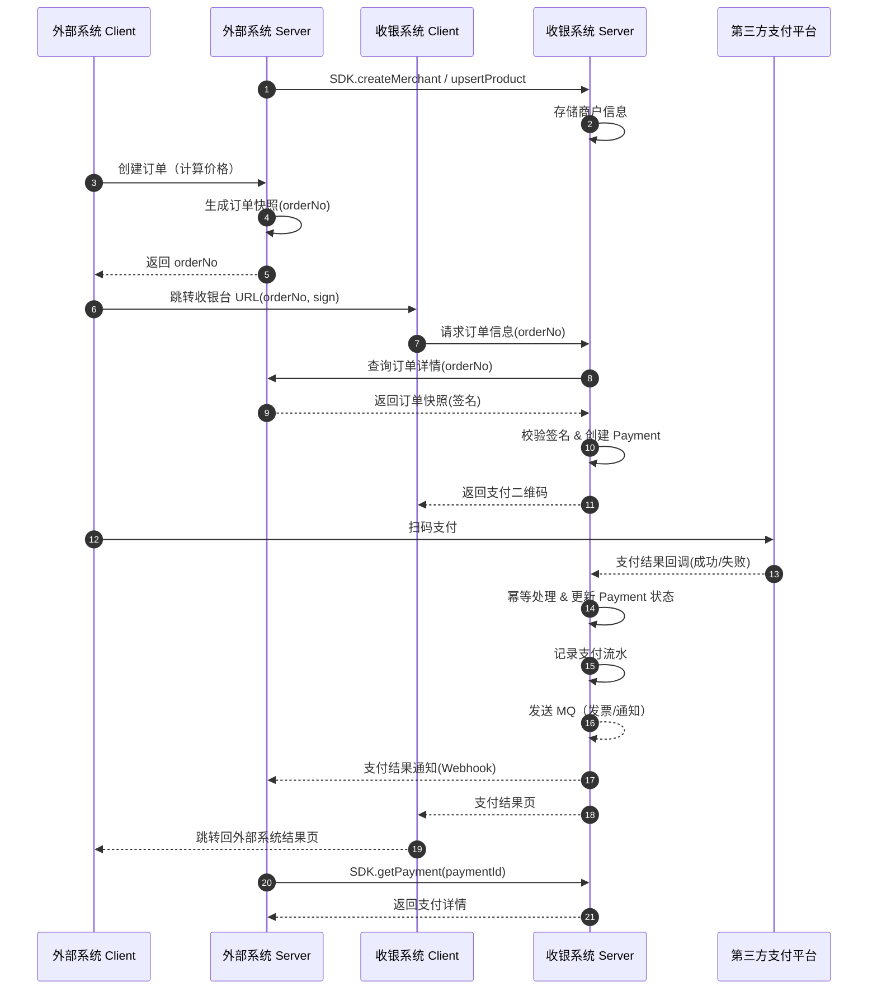

=== 1. 登录 ===
Token: eyJhbGciOiJIUzI1NiIsInR5cCI6Ik...

=== 2. 创建商户 ===
{
  "code": 0,
  "message": "success",
  "data": {
    "merchantId": "mch_0403c7e36c5b",
    "name": "测试SaaS平台",
    "appKey": "ak_08748c1a25b14bb0a6115136750d4df1",
    "appSecret": "1707543c24904cbd9fb9669334b975f71edcf05ebfd548eebd4a26820aff1a3e",
    "status": "active"
  },
  "traceId": "trace_fbd9e8c465fc450b"
}

=== 3. 配置支付渠道 ===
{
  "code": 0,
  "message": "success",
  "data": {
    "merchantId": "mch_0403c7e36c5b",
    "message": "支付渠道配置成功"
  },
  "traceId": "trace_3e65c19a072942d1"
}

=== 4. 创建订单 ===
{
  "code": 0,
  "message": "success",
  "data": {
    "orderId": "ord_20260127_1164cff81753",
    "amount": 9900,
    "status": "pending",
    "expireAt": "2026-01-27T11:22:19.737Z",
    "qrcodeUrl": "<http://localhost:8080/pay/ord_20260127_1164cff81753?t=5b1d5242553f6491bfd3babd826b222f>",
    "cashierToken": "5b1d5242553f6491bfd3babd826b222f"
  },
  "traceId": "trace_298ae9841b1e43ad"
}

=== 5. 获取统一二维码 ===
{
  "code": 0,
  "message": "success",
  "data": {
    "qrcodeUrl": "<http://localhost:8080/pay/ord_20260127_1164cff81753?t=74701b3b6b928c2e8d6eb88d840fa105>",
    "qrcodeData": "<http://localhost:8080/pay/ord_20260127_1164cff81753?t=74701b3b6b928c2e8d6eb88d840fa105>",
    "cashierToken": "74701b3b6b928c2e8d6eb88d840fa105",
    "expireAt": "2026-01-27T11:22:19.737Z"
  },
  "traceId": "trace_6b49c98920fc4f0b"
}

=== 6. 模拟支付回调 ===
{
  "code": 0,
  "message": "success",
  "data": {
    "success": true
  },
  "traceId": "trace_40f1f0c810e14da6"
}

=== 7. 查询订单状态 ===
{
  "code": 0,
  "message": "success",
  "data": {
    "_id": "697898e3c69dc9106be8ce23",
    "orderId": "ord_20260127_1164cff81753",
    "merchantId": "mch_0403c7e36c5b",
    "externalOrderId": "biz_test_001",
    "subject": "高级会员月度订阅",
    "amount": 9900,
    "currency": "CNY",
    "status": "paid",
    "expireAt": "2026-01-27T11:22:19.737Z",
    "clientIp": "::1",
    "createdAt": "2026-01-27T10:52:19.739Z",
    "updatedAt": "2026-01-27T10:52:19.752Z",
    "__v": 0,
    "channelOrderId": "wx_mock_txn_001",
    "paidAt": "2026-01-27T10:52:19.752Z",
    "paymentChannel": "wechat"
  },
  "traceId": "trace_6bae288d2497478b"
}

=== 8. 查询支付记录 (payset) ===
{
  "code": 0,
  "message": "success",
  "data": {
    "total": 1,
    "fieldset": [
      {
        "field": "orderId",
        "label": "订单号",
        "type": "string"
      },
      {
        "field": "subject",
        "label": "商品名称",
        "type": "string"
      },
      {
        "field": "amount",
        "label": "金额(分)",
        "type": "number"
      },
      {
        "field": "status",
        "label": "状态",
        "type": "string"
      },
      {
        "field": "paymentChannel",
        "label": "支付渠道",
        "type": "string"
      },
      {
        "field": "paidAt",
        "label": "支付时间",
        "type": "date"
      }
    ],
    "dataset": [
      {
        "orderId": "ord_20260127_1164cff81753",
        "subject": "高级会员月度订阅",
        "amount": 9900,
        "status": "paid",
        "paymentChannel": "wechat",
        "paidAt": "2026-01-27T10:52:19.752Z"
      }
    ]
  },
  "traceId": "trace_87a2c1204f6f47da"
}

=== 全流程测试完成 ===

